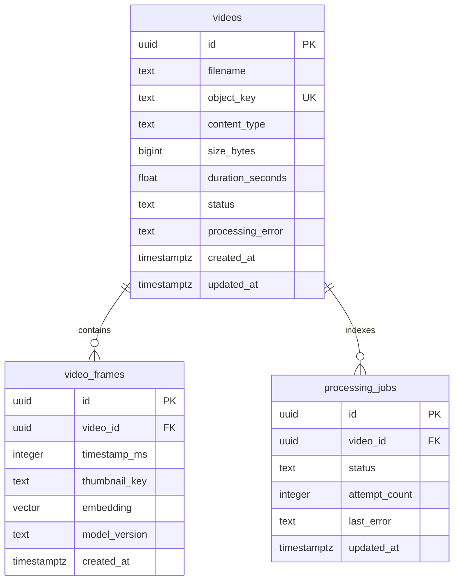

# Database schema and video upload plan

This document explains Developer 1's database and upload design for a reader new
to FrameSearch. It follows the frozen contracts in `FrameSearch_Specs/SPEC.md`,
section 13. The initial implementation is in `db/migrations/001_initial.sql` and
`services/api/`. Backend infrastructure, database tests, signed storage uploads and Kafka
publication have been verified. The complete video-processing path remains
unverified.

## Scope and ownership

Developer 1 owns the PostgreSQL schema, Go public API, MinIO integration, Kafka
publication, and recovery tooling. Developer 2 owns FFprobe/FFmpeg processing,
OpenCLIP inference, the Kafka consumer, frame writes, and the browser interface.
The Go service never decodes videos or calculates embeddings.

The MVP is a single-user local application. Source videos and thumbnails remain
in a private MinIO bucket. PostgreSQL stores metadata, processing state, and frame
vectors; it does not store the media files themselves.

## Database relationships



### `videos`: upload declaration and current processing state

| Column | Type | Rules and purpose |
| --- | --- | --- |
| `id` | UUID | Primary key generated by Go. |
| `filename` | TEXT | Required original display name; API validates a basename with at most 255 characters and no control characters. |
| `object_key` | TEXT | Required, unique; `videos/<uuid>/original.mp4`. |
| `content_type` | TEXT | Required; database and API require `video/mp4`. |
| `size_bytes` | BIGINT | Required declared size, from 1 through 104857600 bytes (100 MiB). |
| `duration_seconds` | DOUBLE PRECISION | Nullable until probed; when present, greater than zero and at most 180 seconds. |
| `status` | TEXT | Required: `awaiting_upload`, `queued`, `processing`, `ready`, or `failed`. |
| `processing_error` | TEXT | Nullable, actionable processor failure message. |
| `created_at` | TIMESTAMPTZ | Required, defaults to database `now()`. |
| `updated_at` | TIMESTAMPTZ | Required; writers update it when state changes. |

Declared content type and filename are not evidence that an object is a valid
video. FFprobe in Developer 2's processor is responsible for checking actual
format, video streams, and duration. Invalid media must become `failed`.

### `video_frames`: timestamped visual-search data

| Column | Type | Rules and purpose |
| --- | --- | --- |
| `id` | UUID | Primary key. |
| `video_id` | UUID | Required foreign key to `videos`; frame rows cascade when their video is deleted. |
| `timestamp_ms` | INTEGER | Required; at least zero and below 180000. |
| `thumbnail_key` | TEXT | Required private MinIO object key. |
| `embedding` | VECTOR(512) | Required genuine normalized OpenCLIP image embedding. |
| `model_version` | TEXT | Required; active contract is `ViT-B-32:laion2b_s34b_b79k`. |
| `created_at` | TIMESTAMPTZ | Required, defaults to `now()`. |

The unique key `(video_id, timestamp_ms, model_version)` makes frame upserts safe
on retry or duplicate events. Developer 2 samples at three-second intervals, up
to 60 frames. Only that processor writes frame rows.

Search joins frames to videos, requires `videos.status = 'ready'` and the active
model version, and optionally filters a single video. It orders by pgvector
cosine distance (`embedding <=> query_vector`) and returns `1 - distance` as raw
similarity. Partial processing results never appear in search.

### `processing_jobs`: durable work and attempt history

| Column | Type | Rules and purpose |
| --- | --- | --- |
| `id` | UUID | Primary key generated by Go. |
| `video_id` | UUID | Required foreign key to `videos`. |
| `status` | TEXT | Required: `queued`, `processing`, `completed`, or `failed`. |
| `attempt_count` | INTEGER | Required, defaults to zero; cannot be negative. Processor increments it when claiming work. |
| `last_error` | TEXT | Nullable failure/recovery detail. |
| `updated_at` | TIMESTAMPTZ | Required, defaults to `now()`; used for stale recovery. |

A partial unique index on `video_id` where status is `queued` or `processing`
allows only one active job for a video. A manual retry creates a new job after
the previous one has durably failed. Completed and failed rows preserve history.

### Indexes and migration strategy

- Enable the PostgreSQL `vector` extension.
- Create a cosine HNSW index on frame embeddings and a frame `video_id` index.
- Index job `status, updated_at` for queued/stale work lookup.
- Enforce object-key uniqueness, frame uniqueness, and the active-job constraint.

The initial migration is transactional, non-destructive, and rerunnable. Future
schema changes should use new migration files rather than silently changing an
already deployed schema. Tiny datasets may use exact distance scans even with
HNSW available. Compose migration execution has been verified against real PostgreSQL/pgvector.

## Browser-to-storage upload sequence

```mermaid
sequenceDiagram
    participant Browser
    participant Go as Go API
    participant DB as PostgreSQL
    participant S3 as Private MinIO
    participant Kafka
    participant Worker as Python processor
    Browser->>Go: POST /videos/upload-url (name, type, size)
    Go->>Go: Validate declaration and generate UUID/key
    Go->>S3: Generate browser-facing presigned PUT locally
    Go->>DB: Insert awaiting_upload video
    Go-->>Browser: 201 video_id, upload_url, object_key
    Browser->>S3: PUT MP4 with Content-Type: video/mp4
    S3-->>Browser: Upload response
    Browser->>Go: POST /videos/{id}/complete
    Go->>S3: HEAD object via internal endpoint
    Go->>Go: Compare size and Content-Type
    Go->>DB: Lock video, insert queued job, update video, commit
    Go->>Kafka: Publish media.uploaded keyed by video_id
    Go-->>Browser: 200 video_id, status
    Worker->>Kafka: Consume event
    Worker->>DB: Atomically claim queued job
    Worker->>S3: Download and validate actual video
    Worker->>S3: Upload extracted frame thumbnails
    Worker->>DB: Upsert vectors; mark job completed and video ready
    Worker->>Kafka: Commit offset after durable terminal state
    Browser->>Go: Poll GET /videos/{id}
    Go-->>Browser: Current status and any processing error
```

All public paths above have the `/api/v1` prefix. Kafka events may be consumed
before the browser receives the completion response; the client should poll the
video's current state rather than assume it is still queued.

### 1. Reserve the upload

`POST /api/v1/videos/upload-url` accepts:

```json
{"filename":"clip.mp4","content_type":"video/mp4","size_bytes":1234567}
```

Go validates the name, type, and size; chooses a UUID and deterministic source
key; generates a 900-second PUT URL; persists `awaiting_upload`; and returns
`201` with `video_id`, `upload_url`, and `object_key`.

Use `S3_ENDPOINT_PUBLIC=http://localhost:9000` for signing URLs returned to the
browser. Go uses `S3_ENDPOINT_INTERNAL` for HEAD/bucket requests. Inside Docker,
the latter will be `http://minio:9000`; returning that hostname to the browser
would break direct uploads. MinIO CORS permits `http://localhost:3000`; the real storage test verified the
browser-origin preflight.

### 2. Upload the bytes

The browser PUTs the actual MP4 directly to the presigned URL with
`Content-Type: video/mp4`, then calls complete only after the PUT succeeds. Go
receives metadata requests rather than proxying the full media body.

An abandoned reservation remains `awaiting_upload`; automatic expiration and
orphan cleanup are future work, not currently implemented.

### 3. Complete and enqueue atomically

For an `awaiting_upload` video, Go HEADs the stored object and compares its byte
size and Content-Type to the declaration. Missing or mismatched objects return
`409` without creating a job.

The enqueue transaction:

1. Locks the video using `SELECT ... FOR UPDATE`.
2. Rechecks its current state under the lock.
3. Inserts a `queued` processing job with a new UUID.
4. Updates the video to `queued`, clears its error, and updates its timestamp.
5. Commits both changes together.

The active-job unique index is an additional concurrency safeguard. Repeated
complete requests on queued, processing, or ready videos return their current
state and create no extra job or event. Complete on a failed video returns `409`;
the explicit retry endpoint handles recovery.

### 4. Publish the frozen Kafka envelope

After the database commit, Go synchronously publishes to `media.uploaded`, keyed
by `video_id`:

```json
{
  "event_id":"<uuid>",
  "event_type":"media.uploaded",
  "schema_version":1,
  "video_id":"<uuid>",
  "job_id":"<uuid>",
  "created_at":"<RFC3339 UTC timestamp>"
}
```

The DB commit and Kafka publication are not atomic. If publication fails, the
job remains queued and Go returns `503` with error code `queued_publish_failed`.
Repeated complete does not repair publication: the recovery CLI republishes
queued jobs. The root `make reconcile` target invokes that CLI.
Delivery can be duplicated; the processor must claim the job atomically and
handle duplicate events safely. There is no exactly-once guarantee or outbox.

## State transitions, retry, and recovery

| Trigger | Video transition | Job transition | Owner |
| --- | --- | --- | --- |
| Upload reservation | New → `awaiting_upload` | None | Go |
| Successful completion | `awaiting_upload` → `queued` | New → `queued` | Go |
| Atomic worker claim | `queued` → `processing` | `queued` → `processing` | Python |
| All frames durably indexed | `processing` → `ready` | `processing` → `completed` | Python |
| Terminal processing failure | `processing` → `failed` | `processing` → `failed` | Python |
| Manual retry | `failed` → `queued` | New → `queued`; old failed row retained | Go |
| Crash recovery with worker stopped | Stale `processing` → `queued` | Same stale job → `queued` | Go recovery CLI |

`POST /api/v1/videos/{id}/retry` permits only failed videos. It verifies the
stored source object and uses the locked enqueue transaction; other states
return `409`. The processor must fail job and video together before retry is
possible.

Queued reconciliation can run while the worker is active. Stale recovery must
first stop the sole worker, then pass `--reconcile --include-stale
--processor-stopped` to the API binary. The default stale threshold is 15 minutes.
Stopping the worker prevents a slow live CPU job from being reclaimed; there is
no lease or fencing system. The recovery implementation reuses the existing job.

## Verification and remaining work

Backend unit/HTTP tests cover reservation validation, object mismatches,
concurrent and repeated completion, publication failure, retry, public response
shapes, and browser-facing URL signing. Separate real DB tests exercise
transactional enqueue, uniqueness, cosine retrieval, and reconciliation when
`TEST_DATABASE_URL` is configured.

Current verified results are in `docs/progress.md`: backend unit tests, race
detection, binary/container builds, real PostgreSQL/pgvector tests, and actual
MinIO/Kafka upload-publication checks passed. Developer 2's decoding/embedding
worker and the full browser upload/search/playback smoke test remain unverified.
